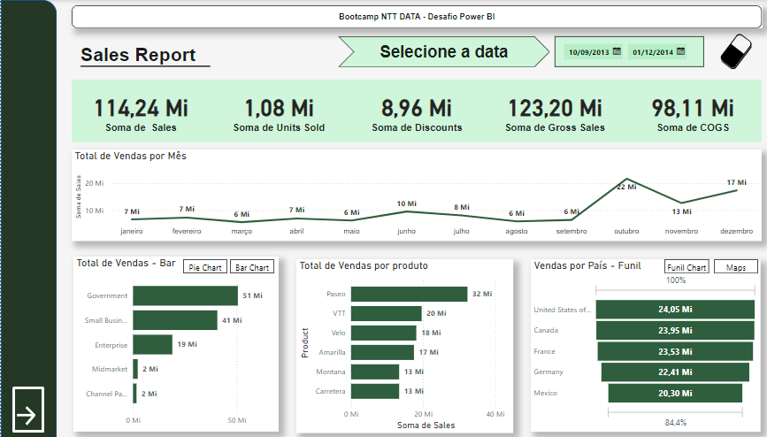

# Dashboard-Projeto-Módulo2 :bar_chart:

## NTT DATA - Engenharia de Dados com Python

  

Descrição.

  

Desafio de projeto do Módulo 2 de Power BI - Visualização de Dados e Relatórios.

  

Dashboard possui 2 páginas com relatórios de diferentes assuntos :

-  **Relatório de Vendas**
 -- Botão para troca de página e para limpar segmentações de data
 
 -- Botão para troca de gráfico em **Total de Vendas** e **Vendas por País**
  
  
  
-  **Relatório de Lucro**
--  Botão voltar para página de Vendas

**No repositório possui o dashboard interativo para download** 